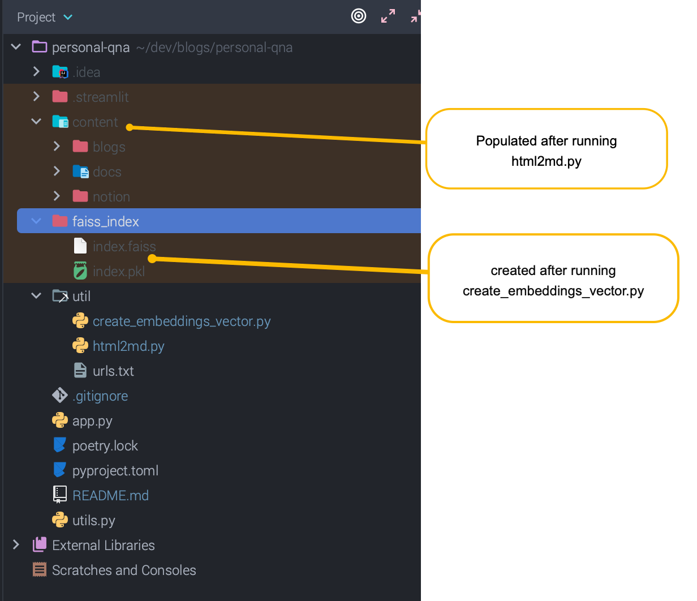

# About
Simple but powerful example using Streamlit, OpenAI, Langchain to create a chatbot that can answer questions about your data.
This example is built to index databricks blogs, databricks documentation, and notion markdown exports

# Running
- navigate to project root
- you will need OPENAI KEY and add to streamlit secrets
  - ``` vi ~/.streamlit/secrets.toml```
  - add `OPENAI_API_KEY = 'sk-aaabbbcccddd'`
- using pyenv to manage python versions - installed 3.11.5
  - ```pyenv local 3.11.5``` to set python version
- using Poetry to manage python packages and virtual environments
  - ```poetry install``` to install dependencies
- populate urls.txt with blog posts of interest (see existing examples).
- run `html2md.py` to convert blog posts and databricks docs to markdown
  - you should have a folder called ```content/blogs``` and ```content/docs``` in the project root 
- if you have notion markdown exports you can unzip them into ```content/notion```
- run ```create_embeddings_vector.py``` to index the content
- run ```streamlit run app.py``` to run the app



# Reference

based on this post: https://blog.streamlit.io/build-your-own-notion-chatbot/

databricks examples:
- ```python
  import dbdemos
  dbdemos.install('llm-rag-chatbot')
  ```
- https://notebooks.databricks.com/notebooks/RCG/diy-llm-qa-bot/index.html#diy-llm-qa-bot_3.html

### related
https://coinsbench.com/chat-with-your-databases-using-langchain-bb7d31ed2e76

